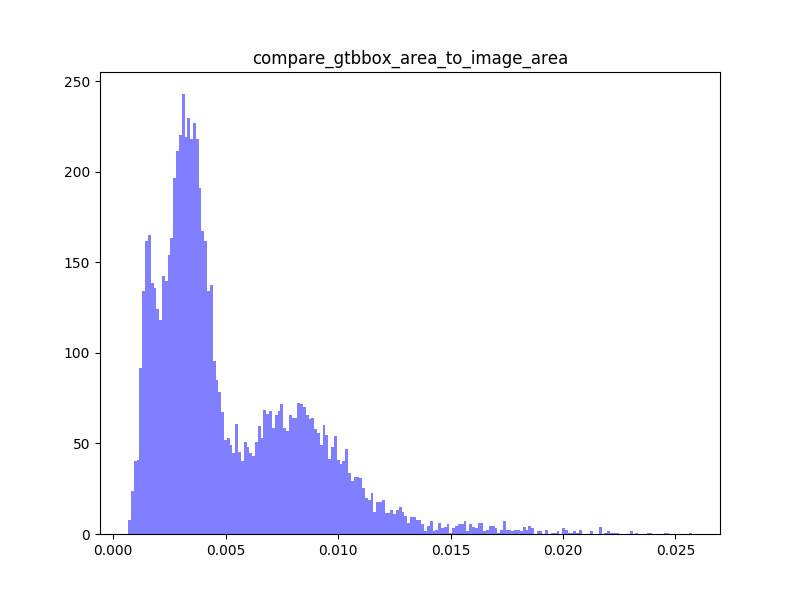

# yolov3.paddle
An yolo v3 implementation with PaddlePaddle.

python inspect_data.py --data_path ../insects/train/
```
valid Images: 1693 total objects: 10347
objs per image [max, avg, min]: [10, 6.1116361488481985, 4]
Generate image: compare_gtbbox_area_to_image_area.png
```


python inspect_data.py --data_path ../insects/val/
```
valid Images: 245 total objects: 1856
objs per image [max, avg, min]: [10, 7.575510204081633, 6]
```
